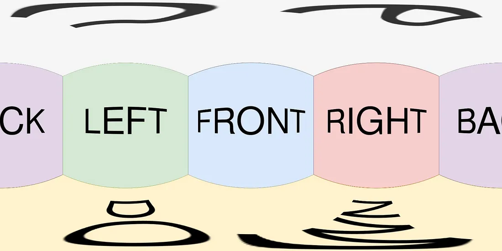
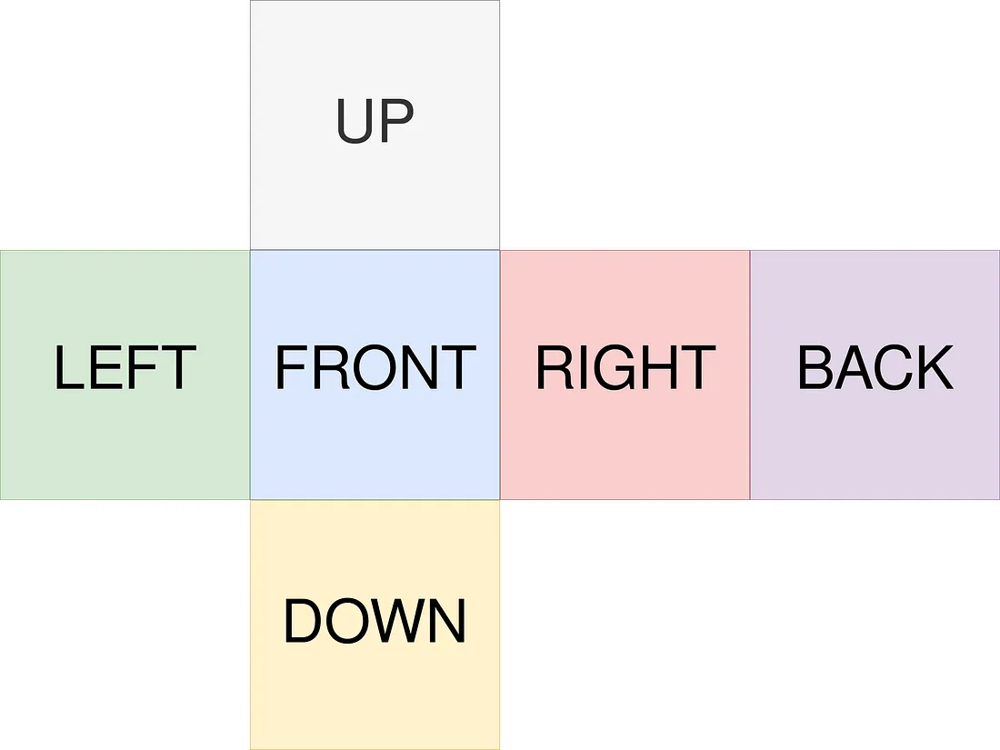
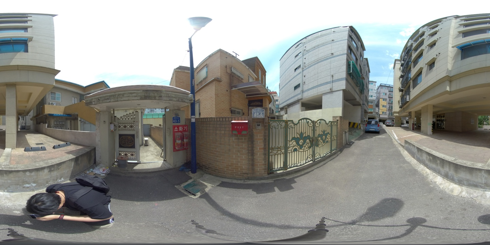
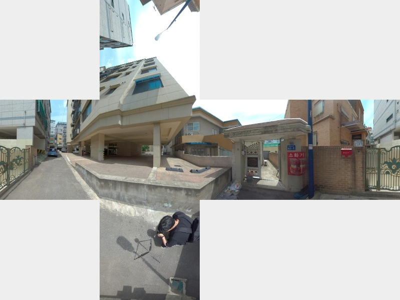

# Spherical-to-CubeMap-Image-Conversion

This repository is represented to the transformation of 360-degree spherical images into a flattened image representation, also known as Cube Maps. 

A Cube Map is a collection of six square 2D textures that represent a 360-degree view of a scene. Each square (or face) of the cube corresponds to one direction of the view - up, down, left, right, front, and back.

<div align="center">
    
     
</div>

### Installation

```bash
pip install Pillow
pip install opencv-python
```

### Usage

```bash
python main.py -p 'download\subdir\' -o 'output' 
```

### Result

<div align="center">
    
     
</div>

### Reference

[Understanding 360 images](https://medium.com/check-visit-computer-vision/understanding-360-images-8e0fcf0ee861)

[Panorama to Cubemap](https://jaxry.github.io/panorama-to-cubemap/)

[Spherical to Cubemap conversion Gist](https://gist.github.com/muminoff/1bc5430684b646c06d245f7f1fdaed57)
